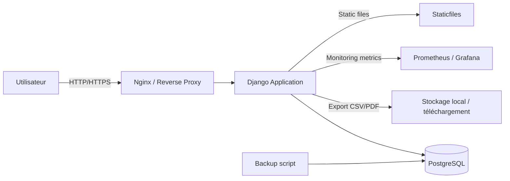

# Architecture — Facturation PME

Ce document décrit l’architecture technique du projet Facturation PME et les principaux flux entre les composants.

## Description

L’application est construite autour d’une application Django qui sert une interface web pour la gestion des factures.
La base de données relationnelle gère les factures, la société et les utilisateurs.
Un reverse proxy ou un service web peut exposer l’application au réseau local ou à Internet.

## Composants clés

- `web` : application Django
- `db` : base de données PostgreSQL
- `reverse proxy` : service web / Nginx en production
- `monitoring` : système de supervision éventuel (Prometheus / Grafana)

## Flux

1. L’utilisateur accède à l’interface web via HTTP/HTTPS.
2. Django traite les requêtes et interagit avec PostgreSQL.
3. Les exports CSV/PDF sont générés à la volée.
4. Les sauvegardes de la base de données sont réalisées via un script dédié.

## Schéma

**Fichier SVG** : voir `docs/architecture_diagram.svg` pour une visualisation complète.

## Notes

- En développement, Docker est utilisé pour construire l’image de l’application et exécuter PostgreSQL.
- En production, une séparation claire entre l’application et la base de données est recommandée.
- Le fichier `docker-compose.yml` montre une configuration de base pour ce déploiement.
