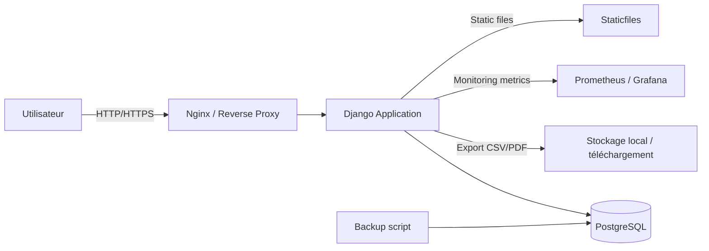

# Documentation Complète — Facturation PME

Ce document regroupe toute la documentation technique du projet Facturation PME.

## Table des matières

1. [Contexte et besoin client](#contexte-et-besoin-client)
2. [Architecture technique](#architecture-technique)
3. [Stack technique](#stack-technique)
4. [Sécurité](#sécurité)
5. [Déploiement sur AWS](#déploiement-sur-aws)
6. [CI/CD GitHub Actions](#cicd-github-actions)
7. [Monitoring](#monitoring)
8. [Présentation orale](#présentation-orale)

---

## Contexte et besoin client

### Client

Une PME souhaitant moderniser sa gestion de facturation.

### Situation initiale

- L'entreprise gère ses factures avec des tableurs et des échanges manuels
- Les factures ne sont pas centralisées et il est difficile de suivre les statuts de paiement
- Le dirigeant veut une interface simple pour créer, consulter et exporter les factures

### Problème

- Les erreurs de saisie se multiplient, les relances sont difficiles et les rapports sont incomplets
- L'entreprise souhaite un outil fiable pour gérer ses factures et exporter les données rapidement
- Il faut un accès sécurisé, une interface de création de facture et un export simple

### Objectif attendu

- Déployer une application web de facturation pour une seule entreprise
- Offrir une interface de dashboard pour créer et suivre les factures
- Permettre l'export des factures en CSV et la génération de PDF

---

## Architecture technique

### Description

L'application est construite autour d'une application Django qui sert une interface web pour la gestion des factures. La base de données relationnelle gère les factures, la société et les utilisateurs.

### Composants clés

- `web` : application Django
- `db` : base de données PostgreSQL
- `reverse proxy` : service web / Nginx en production
- `monitoring` : système de supervision éventuel (Prometheus / Grafana)

### Flux

1. L'utilisateur accède à l'interface web via HTTP/HTTPS
2. Django traite les requêtes et interagit avec PostgreSQL
3. Les exports CSV/PDF sont générés à la volée
4. Les sauvegardes de la base de données sont réalisées via un script dédié

### Schéma



---

## Stack technique

- **Framework** : Django 4.2.27 avec Python 3.12
- **Base de données** : PostgreSQL 15
- **Containerisation** : Docker + Docker Compose
- **Déploiement** : Terraform (AWS EC2)
- **CI/CD** : GitHub Actions
- **Monitoring** : Prometheus + Grafana (optionnel)
- **Génération PDF** : xhtml2pdf, weasyprint

### Séparation des rôles

- `admin` : portail d'administration système
- `assistant` : dashboard de facturation
- Contrôle d'accès par vues Django (PermissionDenied sur accès non autorisé)

---

## Sécurité

### Mesures implémentées

- Authentification Django standard (login/password)
- Séparation des interfaces par rôle utilisateur
- Configuration d'environnement : `SECRET_KEY` et `DEBUG` chargés depuis variables d'environnement
- Pare-feu UFW + SSH sécurisé
- Configuration `ALLOWED_HOSTS` restrictive
- Aucun secret ou mot de passe stocké en clair dans le dépôt

### Contraintes de sécurité

- L'accès à l'application doit être sécurisé par un login/mot de passe
- Un `admin` ne doit pas utiliser la même interface qu'un `assistant`
- Les pages interdites doivent renvoyer une erreur 403

---

## Déploiement sur AWS

### Infrastructure

Le déploiement est automatisé via Terraform sur AWS EC2.

### Configuration Terraform

Le dossier `terraform/` contient toute la configuration Infrastructure as Code :

- `main.tf` : configuration principale (VPC, EC2, Security Groups)
- `variables.tf` : variables Terraform
- `outputs.tf` : outputs Terraform (IP publique, commandes SSH)
- `user_data.sh` : script d'initialisation de l'instance EC2
- `terraform.tfvars` : valeurs des variables

### Procédure de déploiement

1. Configurer les credentials AWS
2. Initialiser Terraform : `terraform init`
3. Planifier le déploiement : `terraform plan`
4. Appliquer le déploiement : `terraform apply`

---

## CI/CD GitHub Actions

### Workflow

Le déploiement est automatisé via GitHub Actions. À chaque push sur la branche `main` :

1. **Tests** : Exécution des tests unitaires Django
2. **Build** : Construction de l'image Docker et push sur GitHub Container Registry
3. **Sécurité** : Scan de vulnérabilités avec Trivy
4. **Déploiement** : Déploiement automatique sur l'instance EC2 AWS

### Configuration

Le workflow est défini dans `.github/workflows/ci.yml`.

### Secrets GitHub requis

- `SSH_PRIVATE_KEY` : Clé SSH pour l'accès à l'instance EC2
- `EC2_IP` : Adresse IP de l'instance EC2
- `EC2_USER` : Utilisateur EC2 (ubuntu)
- `DJANGO_SECRET_KEY` : Clé secrète Django
- `DB_PASSWORD` : Mot de passe PostgreSQL

---

## Monitoring

### Configuration

Le monitoring avec Prometheus + Grafana est optionnel.

### Démarrage

```bash
cd docker
docker compose -f docker-compose.yml -f docker-compose.monitoring.yml up -d --build
# Django : http://localhost:8000/
# Prometheus : http://localhost:9090
# Grafana : http://localhost:3000 (admin/admin)
```

### Métriques

L'application intègre `django-prometheus` pour exposer les métriques Django.

---

## Présentation orale

### Structure recommandée

#### Introduction (1 min)

- Présente rapidement le client fictif : une PME qui a besoin d'un outil simple de facturation
- Explique le problème actuel : gestion manuelle, erreurs, manque de centralisation
- Présente la solution : application web Django moderne et sécurisée

#### Présentation de la solution (2 min)

- Montre les fonctionnalités principales : dashboard, création de factures, export CSV/PDF
- Explique l'architecture : Django, PostgreSQL, Docker, AWS
- Démontre la séparation des rôles : admin vs assistant

#### Démonstration (3 min)

- Montre l'interface en direct
- Crée une facture avec lignes dynamiques
- Exporte en CSV et génère un PDF
- Montre le dashboard avec les métriques financières

#### Infrastructure et sécurité (2 min)

- Explique le déploiement sur AWS via Terraform
- Montre l'automatisation CI/CD avec GitHub Actions
- Présente les mesures de sécurité : authentification, rôles, secrets

#### Conclusion (1 min)

- Résume les bénéfices pour le client
- Présente les perspectives d'évolution
- Ouvre la discussion

---

## Environnements

### Développement

```bash
cd src
python manage.py migrate
python create_superuser.py
python manage.py runserver
# Accès : http://localhost:8000/
```

### Docker

```bash
cd docker
docker compose up -d --build
# Accès : http://localhost:8000/
```

### Production

Le déploiement en production est automatisé via GitHub Actions. L'application est accessible via l'IP publique de l'instance EC2.

---

## Technologies utilisées

- **Backend** : Django 4.2.27
- **Base de données** : PostgreSQL 15
- **Containerisation** : Docker + Docker Compose
- **Génération PDF** : xhtml2pdf, weasyprint
- **Monitoring** : Prometheus + Grafana (optionnel)
- **Infrastructure** : Terraform (AWS)
- **CI/CD** : GitHub Actions
- **Hébergement** : AWS EC2

---

## Fonctionnalités

- Page d'accueil professionnelle avec présentation des fonctionnalités
- Gestion des clients : création, modification, suppression
- Création de factures avec lignes de facturation dynamiques
- Modification de factures existantes
- Calcul automatique du montant HT, TVA et TTC
- Export des factures en CSV
- Génération de PDF de facture
- Suivi des statuts : Brouillon, Envoyée, Payée, En retard
- Gestion des paiements avec historique
- Authentification Django standard
- Dashboard avec métriques financières
